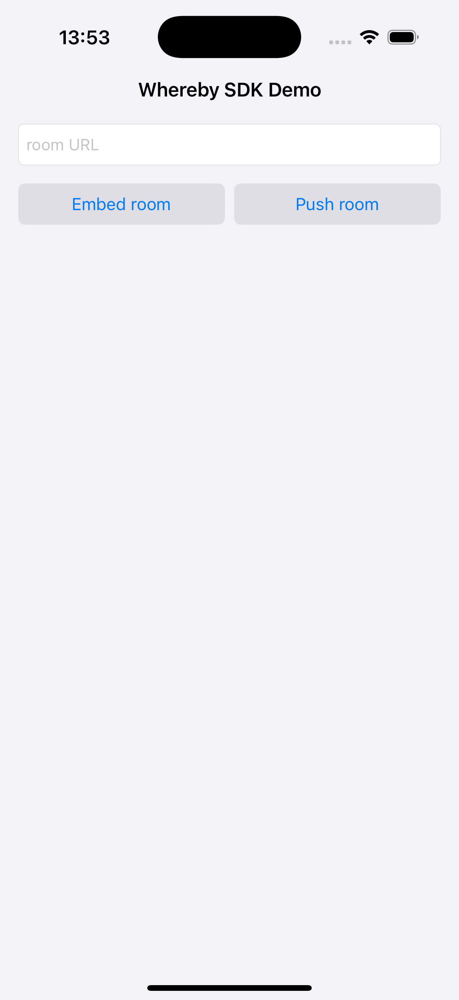

# Whereby iOS SDK demo

## Overview

This repository contains a sample app in Swift using the [Whereby iOS SDK](https://github.com/whereby/ios-sdk).

Other platforms:

- [Android SDK](https://github.com/whereby/android-sdk)
- [Browser SDK](https://github.com/whereby/sdk)

| Screen 1 | Screen 2 | Screen 3 |
|-------------|-------------|-------------|
|  |  |  |

## Prerequisites

- The latest stable version of [Xcode](https://apps.apple.com/us/app/xcode/id497799835)
- The latest stable version of [cocoapods](https://cocoapods.org/)
- Sign up to [Whereby Embedded](https://whereby.com/information/embedded/) account
- [Create a room](https://docs.whereby.com/creating-and-deleting-rooms) in your Whereby Embedded account

## Using the app with Cocoapods

1. Install WherebySDK dependency using cocoapods. Starting at the root folder of this repo:

```
cd [project root path]/Demo-CocoaPods
pod install
```

2. Open `WherebySDKDemo.xcworkspace` in Xcode.
3. In `DemoViewController.swift` provide your room URL to open in the demo app.
4. Run the project.

## Using the app with Swift Package Manager

1. Navigate to the Demo-SwiftPM folder:

```
cd [project root path]/Demo-SwiftPM
```

2. Open `WherebySDKDemo.xcodeproj` in Xcode.
3. Select **File > Add Packages...**
4. In the Search or Enter Package URL text field, enter the repository URL

```
https://github.com/whereby/ios-sdk.git
```

5. In `DemoViewController.swift` provide your room URL to open in the demo app.
6. Run the project.

## Disclaimer

Whereby publishes these packages to help the developer community understand how the Whereby Embedded product can be implemented.

Whereby does not recommend using such examples in a production environment without a prior assessment and appropriate testing relevant to the production setup targeted which can be of operational, technical, security or legal (e.g. library licenses assessment) nature. You expressly agree that the use of these packages is at your sole risk.

Whereby, its affiliates, suppliers, or licensors, whether express or implied, do not make any representation, warranties, contractual commitments, conditions, or assurances by the operation of these examples, or the information, content, materials, therein.
